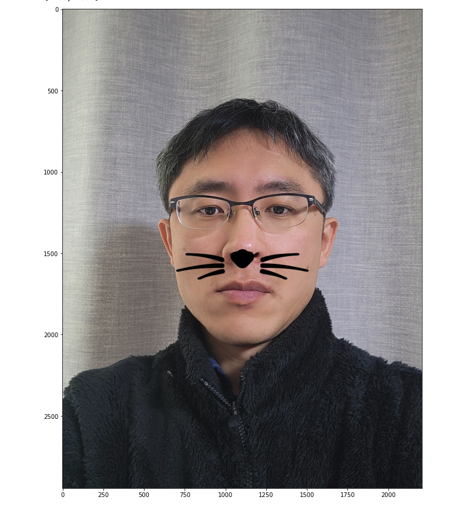
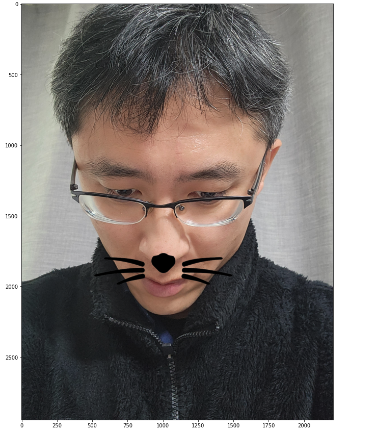
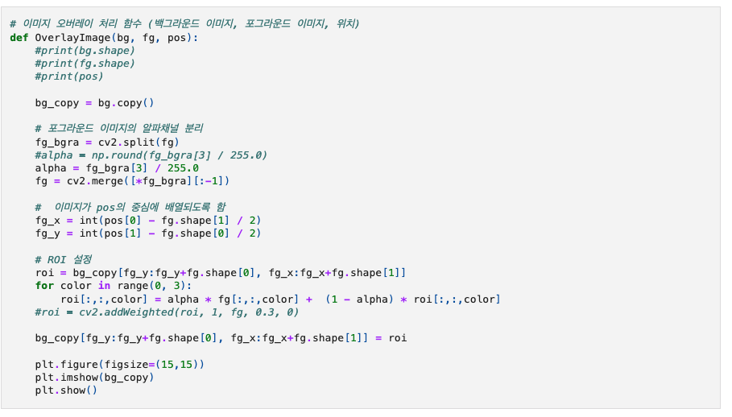
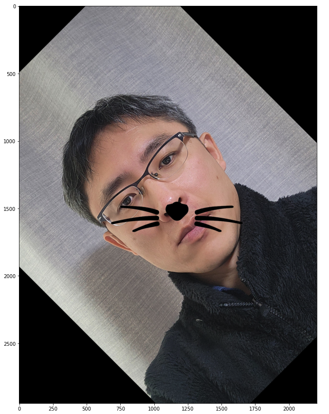
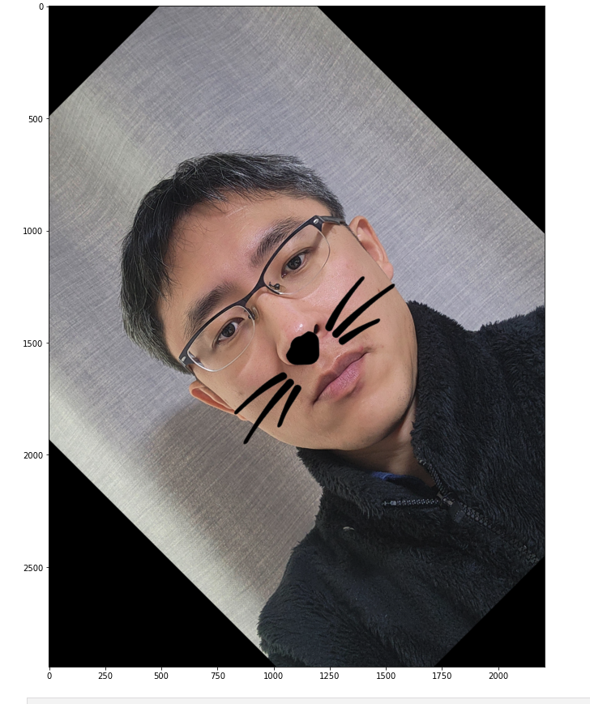
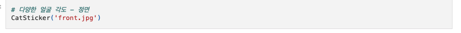
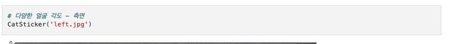

# AIFFEL Campus Online Code Peer Review Templete
- 코더 : 이 동건
- 리뷰어 : 김 영만


# PRT(Peer Review Template)
- [*]  **1. 주어진 문제를 해결하는 완성된 코드가 제출되었나요?**
    - 얼굴 영역과 랜트마크를 정확하게 검출 하였습니다.
    - 스티커 사진 합성을 완성 하셨습니다.
    - 정확한 좌표 계산을 통해 고양이 수염의 위치 조금 아래이긴 하지만 원본 얼굴에 잘 어울리게 구현 하였습니다.
    - 얼굴각도, 이미지 밝기, 촬영거리 등 다양한 변수에 따른 영향도를 체계적으로 구현 하였습니다.
        -  
        -  
    
- [*]  **2. 전체 코드에서 가장 핵심적이거나 가장 복잡하고 이해하기 어려운 부분에 작성된 
주석 또는 doc string을 보고 해당 코드가 잘 이해되었나요?**
    - 이미지 오버레이 하는 함수로 백그라운드, 포그라운드 이미지 관련 작업이 구현 되어 
      가독성이 좋았습니다.
    - 해당 코드 블럭의 주석을 보고 이해 할 수 있었습니다.
     -  
        
- [*]  **3. 에러가 난 부분을 디버깅하여 문제를 해결한 기록을 남겼거나
새로운 시도 또는 추가 실험을 수행해봤나요?**
    - 회전 각도를 구현 부분이 있어 추가 실험을 충실히 했음을 알 수 있었습니다.
    -  
    -  
        
- [ ]  **4. 회고를 잘 작성했나요?**
    - 주어진 문제를 해결하는 완성된 코드 내지 프로젝트 결과물에 대해
    배운점과 아쉬운점, 느낀점 등이 기록되어 있는지 확인
    - 전체 코드 실행 플로우를 그래프로 그려서 이해를 돕고 있는지 확인
        - 중요! 잘 작성되었다고 생각되는 부분을 캡쳐해 근거로 첨부
        
- [*]  **5. 코드가 간결하고 효율적인가요?**
    - CatSticker 함수를 작성하여 전체 과정을 구현하여 간결하고 효율적이었습니다.
    -  
    -  
        


# 회고(참고 링크 및 코드 개선)
```
프로젝트 요구사항을 다 충족 시키고 추가 적인 작업까지 완성 되어 있고,
또한, 함수로 중요 부분을 작성 하여 가독성을 높여 감명을 받았습니다.
```
