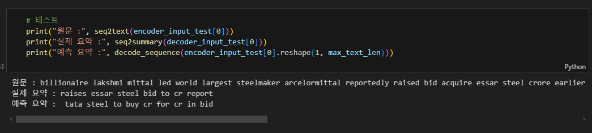
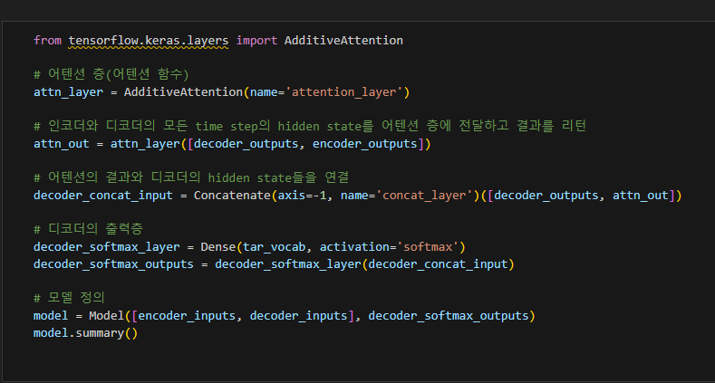
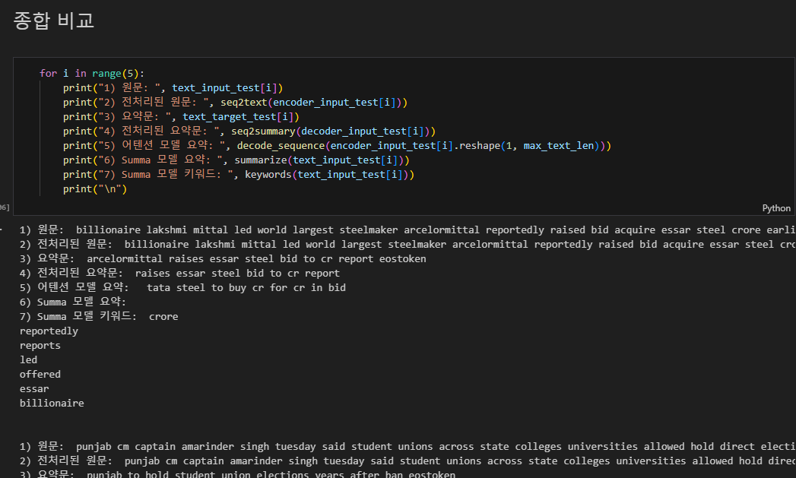
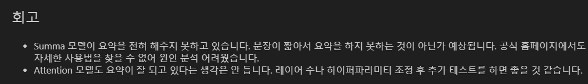
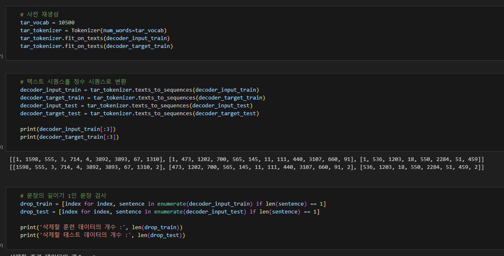

# AIFFEL Campus Online Code Peer Review Templete
- 코더 : 이동건
- 리뷰어 : 조성우


# PRT(Peer Review Template)
- [X]  **1. 주어진 문제를 해결하는 완성된 코드가 제출되었나요?**
        
    - 전처리부터 학습까지 완료되어 추론한 모습을 확인할 수 있었습니다.
    
- [X]  **2. 전체 코드에서 가장 핵심적이거나 가장 복잡하고 이해하기 어려운 부분에 작성된 
주석 또는 doc string을 보고 해당 코드가 잘 이해되었나요?**
        
    - 프로젝트의 핵심인 모델 설계 부분에서 단계별로 주석을 작성해주셔서 이해하기 편했습니다.
        
- [X]  **3. 에러가 난 부분을 디버깅하여 문제를 해결한 기록을 남겼거나
새로운 시도 또는 추가 실험을 수행해봤나요?**
    - Summa로 추출적 요약을 진행했을 때 문장 길이가 짧아 원활하게 추출이 안되었기 때문에 키워드 추출을 진행하여
        내용을 정리하셨다고 설명해주셨습니다.
        

        
- [X]  **4. 회고를 잘 작성했나요?**
    - 프로젝트 진행 과정에서 Summa 모델 활용에서 생긴 문제점, Attention 모델 요약의 결과에 대한 정리가 분명하게 정리되어 있었습니다.
        
        
- [X]  **5. 코드가 간결하고 효율적인가요?**
    - 수행 단위별로 실행되는 코드를 잘 구분하여 주셔서 읽고 이해하기에 좋았습니다.
    


# 회고(참고 링크 및 코드 개선)
```
프로젝트를 진행하며 같은 문제점들을 직면했어서 공감이 가는 부분들이 많았으며, 
직접 trainable parameter를 계산하며 모델을 이해하려고 노력하신 점이 돋보였습니다. 
이외에도 제 3자가 결과를 확인했을 때 이해할 수 있도록 코드 수행 단위를 분명히 하신 점을 보고 
저 또한 조금 더 깔끔히 작성할 수 있도록 노력해야겠다는 생각 또한 들었습니다. 
```
