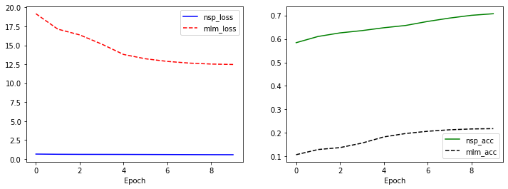
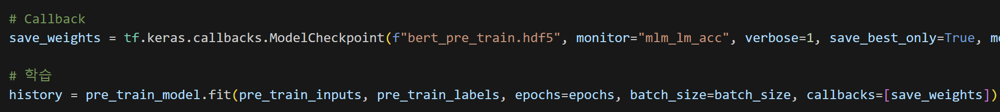
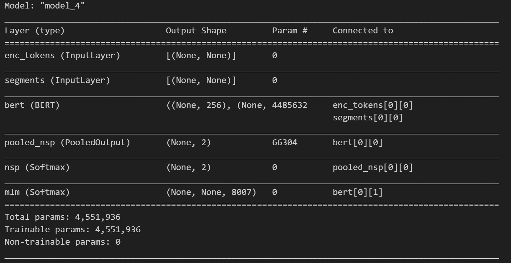
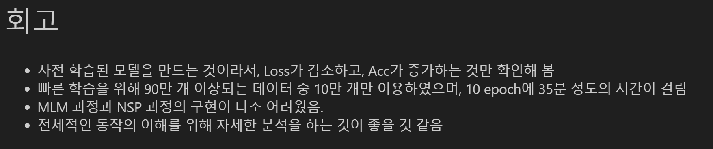
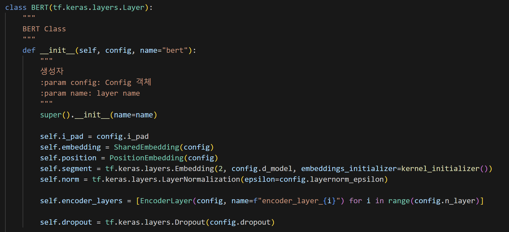

# AIFFEL Campus Online Code Peer Review Templete
- 코더 : 이동건
- 리뷰어 : 손병진

# PRT(Peer Review Template)
- [x]  **1. 주어진 문제를 해결하는 완성된 코드가 제출되었나요?**
    - 목표로 했던 vocab_size = 8000 일때 NSP와 MLM 정확도 오차 그래프를 그려보고 결과 확인함.
        
    
- [x]  **2. 전체 코드에서 가장 핵심적이거나 가장 복잡하고 이해하기 어려운 부분에 작성된 
주석 또는 doc string을 보고 해당 코드가 잘 이해되었나요?**
    - 프로젝트 수행에 필요한 코드를 적절히 작성하여 사용하였음.
        
        
- [x]  **3. 에러가 난 부분을 디버깅하여 문제를 해결한 기록을 남겼거나
새로운 시도 또는 추가 실험을 수행해봤나요?**
    - 모델 파라미터와 구조를 출력하여 모델의 볼륨을 확인하고 이를 기록함.
        
        
- [x]  **4. 회고를 잘 작성했나요?**
    - 결론에 대한 생각이나 프로젝트 진행 당시 느꼈던 점을 상세히 적어놓음.
        
        
- [x]  **5. 코드가 간결하고 효율적인가요?**
    - 모델 설계 코드를 class로 모듈화하여 효율적으로 코드 작성함.
        

# 회고(참고 링크 및 코드 개선)
- 모델 파라미터를 살펴보면 제가 구현한 모델보다 볼륨이 4배정도 더 큰데 그에 따라 MLM 학습이 효율적으로 진행되는것을 확인하였고, MLM같은 예측어려운 부분을 학습할땐 적절한 모델규모를 세팅해줘야하는 것을 한번더 알게되었습니다.
